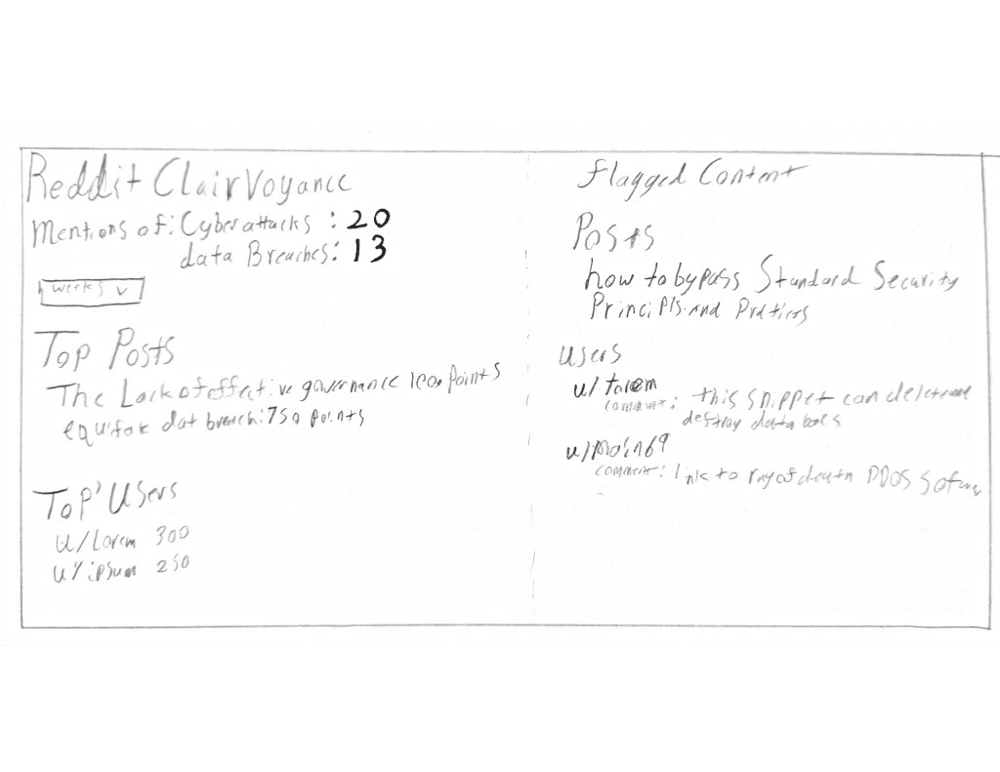
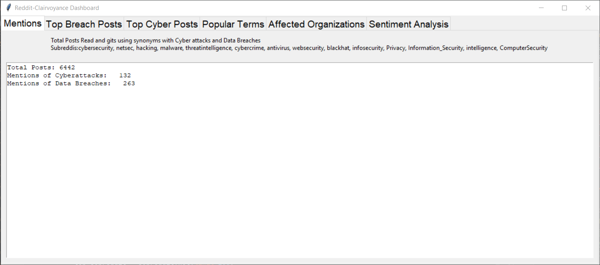
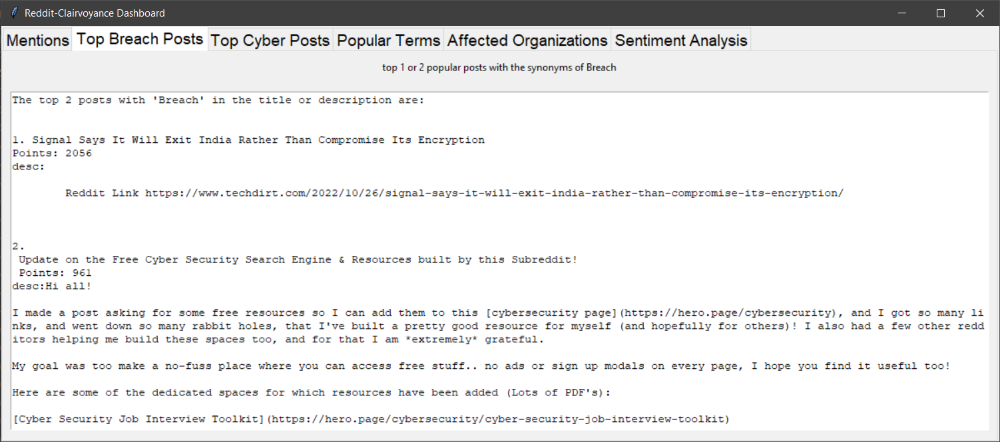
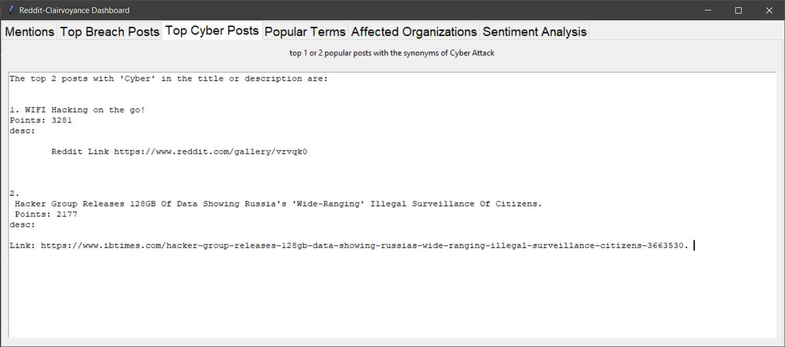
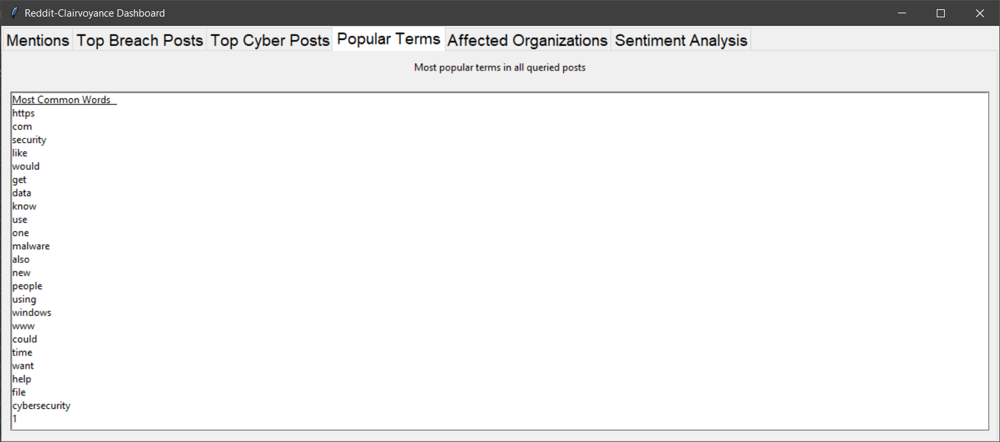
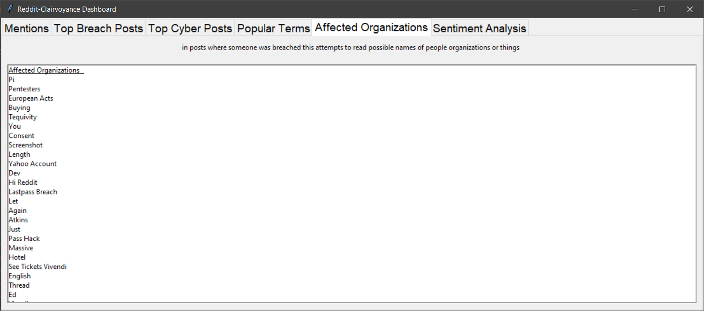
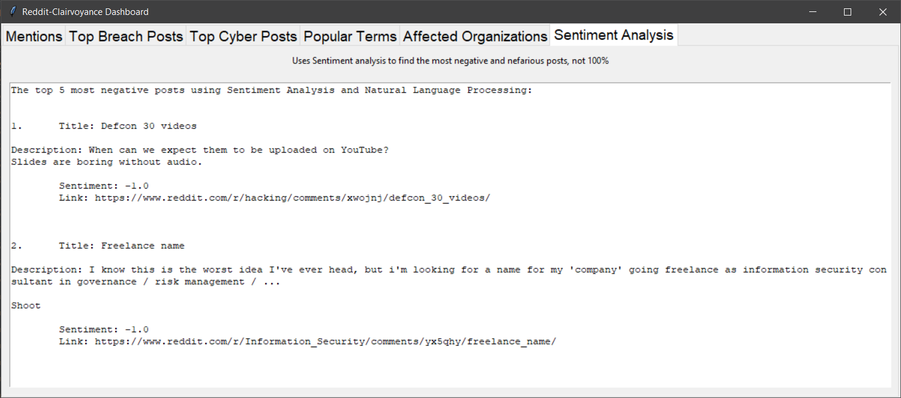

# Reddit-Clairvoyance
USing OSINT Techniques To learn about Cyberattack Rates and topics while gathering a List of Users nad  posts processed thorough a natural language model to gauge malice or likelihood of malicious intent in the posts/comments.

One of the key features of Reddit-Clairvoyance is its ability to identify and flag potentially malicious content. Through the use of natural language processing (NLP) the system can analyze posts and comments to determine the likelihood of malicious intent or harmful behavior.

Features:

In addition to identifying potentially malicious content, Reddit-Clairvoyance can also gather information about cyberattack rates and topics. the system can collect data from various sources, such as news articles, social media, and public reports, to create a comprehensive view of the current cybersecurity landscape.

Mentions Tab: Provides the total number of posts read and gives the number of posts using synonyms related to cyber attacks and data breaches. This tab displays the data from various subreddits such as cybersecurity, netsec, hacking, malware, threatintelligence, cybercrime, antivirus, web security, blackhat, info security, privacy, information security, intelligence, and computer security.

Top Breach Posts Tab: This tab displays the top one or two popular posts related to data breaches using synonyms of the term 'breach.'

Top Cyber Posts Tab: This tab displays the top one or two popular posts related to cyber attacks using synonyms of the term 'cyber attack.'

Popular Terms Tab: This tab displays the most popular terms used in all queried posts.

Affected Organizations Tab: This tab attempts to read possible names of people, organizations, or things in posts where someone was breached.

Sentiment Analysis Tab: This tab uses sentiment analysis to find the most negative and nefarious posts. Note that this analysis is not 100% accurate.

## Dashboard Sketch

## Dashboard

## Using reddit clairvoyance

Install Python 3.x on your machine.
Clone or download the repository.
Install the required dependencies using pip: pip install -r requirements.txt
Run the main.py file to start the application.

Usage:

Once the application is launched, select the tab that corresponds to the analysis you want to perform.
Wait for the application to gather data from various subreddits.
The results will be displayed in the respective tabs in the application.